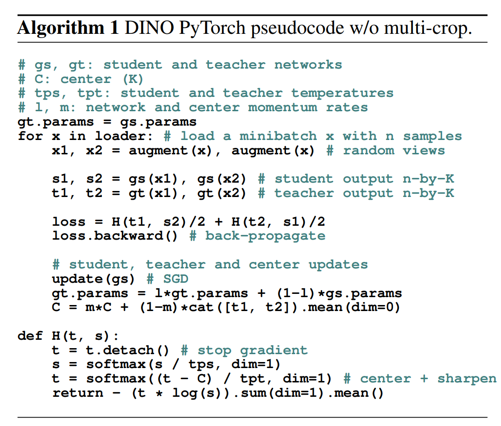

# [DINO: Emerging Properties in Self-Supervised Vision Transformers](https://arxiv.org/pdf/2104.14294.pdf)

## 摘要简介
作者研究了自监督对ViT提取特征的影响，发现了在有监督ViT和卷积网络中没有的属性：1,自监督ViT的特征包含了显式的图像语义信息, 这个信息可以直接访问最后一个块的自监督层的cls-token得到(如图1所示); 2,这些特征通过KNN分类器, Small ViT在ImageNet可以达到78.3%的准确率, 这种情况仅仅出现使用了动量编码器和multi-crop增强方式时, 作者也发现使用小的patch可以提升特征提取质量。因此提出了一个简单的不需要标签的自蒸馏方法, 名字叫做DINO(**DI**stillation with **NO** labels), 直接简单的使用半监督方法去预测Teacher模型(使用动量更新)的输出(交叉熵损失)。这个方法只会在center和sharpen情况下有效，否则会带来模式崩塌，其他组件如分类器、正则化和对比损失对于稳定性和性能有少许提升。

    
    
    

## 相关工作
**自监督学习** &emsp; 目前很有很多自监督学习工作关注于实例分类，这种方法在图片数量很多时就不会太友好，然后有学者提出噪声对比评估器(noise contrastive estimator--NCE), 去对比很多相似图片的特征性，这个需要较大的batchsize和内存。最近的工作中，Grill et al.提出了度量学习方法，将特征与使用动量编码器获得的表示进行匹配来训练特征，后续有人展示出一个特征可以与多个特征表示做匹配，即匹配一个均匀分布，这篇文章使用了类似的方法但是不同的匹配损失。

**训练崩塌** &emsp; 大部分的自监督训练都是通过约束同一张图的不同形态之间的特征差异性来实现特征提取，不同形态一般通过指定的数据增强实现，那么如果只是这么做的话（只有正样本对），网络很容易对所有输入都输出一个固定值，这样特征差异性就是0，完美符合优化目标，但这不是我们想要的，这就是训练崩塌了。因此一个自然的想法是我们不仅仅要拉近相同数据的特征距离，也要拉远不同数据的特征距离，换句话说就是不仅要有正样本对，也要有负样本对，这确实解决了训练崩塌的问题，但是也带来了一个新的问题，那就是对负样本对的数量要求较大，因为只有这样才能训练出足够强的特征提取能力，因此我们可以看到这方面的代表作如SimCLR系列都需要较大的batch size才能有较好的效果。

## 方法

DINO使用最近自监督的结构也是和知识蒸馏架构类似，$g_{\theta_s}$, $g_{\theta_t}$分别对应student-teacher模型(结构一样参数不同)，$\theta$为模型的参数，网络输入一张图片，输出一个K维特征$P$，经过正则化处理，$\tau_s$为temperature参数控制Sharpen处理。给定一个模型后，通过最小化交叉熵损失来让模型学习匹配数据分布。
$$
P_s(x)^{(i)}=\frac{exp(g_{\theta_s}(x)^{(i)}/{\tau_s})}{\sum_{k=1}^{K}exp(g_{\theta_s}(x)^{(i)}/\tau_s}\\
$$
$$
\min_{\theta_s}H(P_t(x), P_s(x)) \text{ where } H(a,b) = -alogb
$$
作者在训练过程中从给定图片中，通过不同的增强方式生成了两个全局view和一些crop, 所有view都通过student模型, 但是只有全局view通过teacher模型, 这样就可以强制让模型学到局部到全局的语义一致性，loss公式如下:
$$
\min_{\theta_s} \sum_{x \in \{x_1^g, x_2^g\}} \sum_{\substack{x' \in V \\
 x' \neq x}} H(P_t(x), P_x(x'))
$$

**Teacher 模型** &emsp; 不同于半监督和蒸馏结构，$g_{\theta_t}$没有一个先验知识，通过EMA从头迭代所得，即动量更新规则为$\theta_t \leftarrow \lambda \theta_t + (1-\lambda)\theta_s$, $\lambda$符合从0.996~1的cosine更新规则。作者在实验过程中也观测到teacher模型表现上与带指数衰减Polyak-Ruppert平均的集成模型类似(Indeed, we observe that this teacher performs a form of model ensembling similar to Polyak-Ruppert averaging with an exponential decay. Using PolyakRuppert averaging for model ensembling is a standard practice to improve the performance of a mode)。并且也观察到teacher模型的表现优于student模型，所以可以提供高质量的特征。

**网络结构** &emsp; backbone $f$可以选用ViT或者ResNet, 然后后面接了一个project head $h$: $g=h \circ f$，head为一个3层的MLP, 中间隐藏层维数为2048维并跟随一个$e_2$正则化，然后输出K维数据特征，作者也尝试过其他head, 但是发现这个head是最好的。
**Avoid collapse** &emsp; 不同的集中自监督学习通过不同的操作去避免模型崩塌，有通过对比loss、聚类约束、预测头和正则化的，DINO可以只用center和sharpen操作配合动量teacher模型就可以避免模型崩塌。center可以阻止某一维占主导地位但是会带来崩塌，但是sharpen有着相反的作用，两种操作和动量teacher模型相互配合就可以避免崩塌，这种方式对于batch的依赖更少。center操作依赖一阶batch统计信息和可以向teacher模型添加一个偏置: $g_t(x) \leftarrow g_t(x)+c$。center $c$通过ema更新，这样可以让$c$在整个数据上有效，其中m是一个动量参数，B是batchsize。
$$
c \leftarrow mc + (1-m)\frac{1}{B}\sum_{i=1}^{B}g_{\theta_t}(x_i)
$$

**实现细节** &emsp; batchsize=1024, VIT-S/16, 学习率10个epoch逐渐升到基础学习率: $lr = 0.0005 \times batchsize/256$, 在热身训练之后，使用cosine策略衰减学习策略，weight decay同样服从cosine策略，从0.01到0.4，temperature $\tau_s$ 被设置为0.1，$\tau_t$ 在热身阶段从0.04升到0.07。使用BYOL一样的数据增强方式(color jittering, Gaussian blur and solarization--反转作用, 提升暗部亮度而中间亮度被抑制)和双线性插值的multi-crop。

**评估策略** &emsp; 标准的自监督学习评估目标是通过固定或者微调特征提取层，然后再下游任务寻来你分类器进行评估。作者通过在训练阶段随机裁剪和水平翻转数据增强方式，以中间的crop来报告准确率，初始化网络参数为预训练参数然后进行训练，作者发现评估是对超参敏感的，观察到较大的方差。所以改用较为简单的KNN作为分类器，固定预训练模型然后存储计算特征，然后按照有标签的数据所计算的特征作为KNN初始图，采用投票方案，在20NN时效果比较好，这种评估方法不再需要超参数调节，非常简单，但是达到不错的效果。

## 实验

### 自监督在ImageNet上下游分类任务--同backbone和不同backbone

### 自监督训练的ViT的属性
在最邻近搜索和保持目标位置信息和对下游任务的迁移能力上的属性

#### 最邻近检索
**图像检索** &emsp; 使用mAP指标，固定提取特征层，直接使用KNN检索。

**复制检测(Copy detectio)** &emsp; 这个任务是去识别出因为模糊、插画、打印、扫描等失真的图片，使用余弦相似度，采用白化whitening(去除输入数据的冗余信息，除去特征之间的相关性，所有特征具有相同的方差)

#### 图像语义信息
如图1所示，在ViT的Self-attention map中包含了图像的语义分析，这里在一个基准上直接探查注意力Map的质量进行度量。作者保留了最大60%有效信息，虽然在自注意力卷积网络中也包含语义信息，但是需要10多中方法才能够得到。

#### 下游任务中的迁移能力

## 附录
