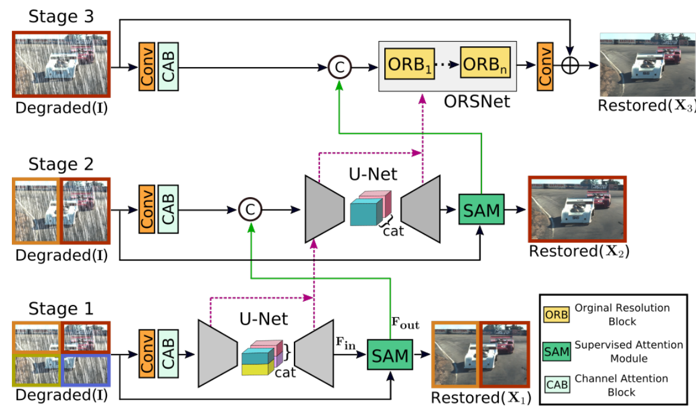
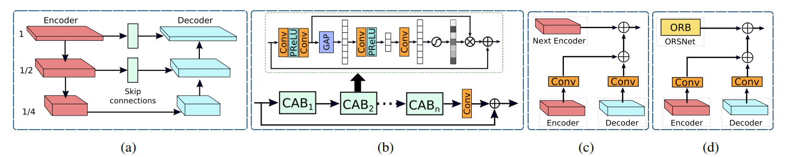
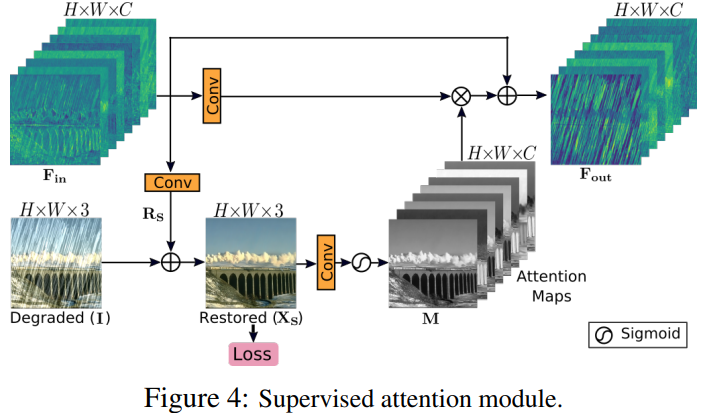

# [Multi-Stage Progressive Image Restoration]()

## Contributions
1 A novel multi-stage approach capable of generating contexturally-enriched and spatially accurate outputs. Due to its multi-stage nature, our framework breaks down the challenging image restoration task into sub-tasks progressively restore a degraded image.
1 一个能够生成丰富纹理和准确空间的多阶段方法。由于多阶段本质，我们的架构将图像恢复任务分为循序渐进的几个子任务。
2 An effective supervised attention module that takes full advantage of the record image at every stage in refining incoming features before propageting them further.
一个有效的监督注意力模块，它在进一步传播之前充分利用每阶段的记录图像来细化传入特征
3 a strategy to aggregate multi-scale features across stages.
3 一个跨阶段聚合多尺度特征的策略

## Method: Multi-Stage Progressive Restoration

**Fig 1** Earlier stages employ encoder-decoders to extract multi-scale contextualized features, while the last stage operates at the original image resolution to generate spatially accurate outputs. A supervized attention mudule is added between every two stages that learns to refine features of one stage before passing them to the next stage. Dotted pink arrows represent the cross-stage feature fusion mechanism.
注：在stage1中，图像分成四份进入编码器，在进入解码前合并为左右或者上下两部分图像。每个编码器和解码器分为三个子层，

**Fig 2** 
(a) Encoder-decoder subnetwork
基于U-Net, 在每个尺度添加Channel Attention Block(CAB)去提取特征，在U-Net中跨越连接中(Skip Connection)依然使用CAB，使用双线性插值上采样(Bilinear Upsample)代替反卷积(Transposed Convolution)以减少输出图像中的棋盘格现象。
(b) Original resolution block(ORB) 不使用任何降采样(Down Sample)操作以生成空间信息高分辨率的特征，包含多个ORB和每个ORB中包含CAB。
(c) Cross-stage feature fusion(CSFF) between stage 1 and stage 2, 在U-Net中的每一层都使用这个相同的操作。
(d) CSFF between stage 2 and last stage

**Fig 3** Supervized Attention Module(SAM)
Fin经过卷积得到Rs, Rs与输入I相加得到得到Xs, Xs与目标图像计算loss, Xs经过卷积得Attention Maps, 再与Fin经过卷积后的特征图做乘法, 最后与Fin相加得到Fout.
