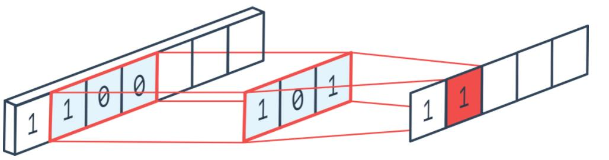
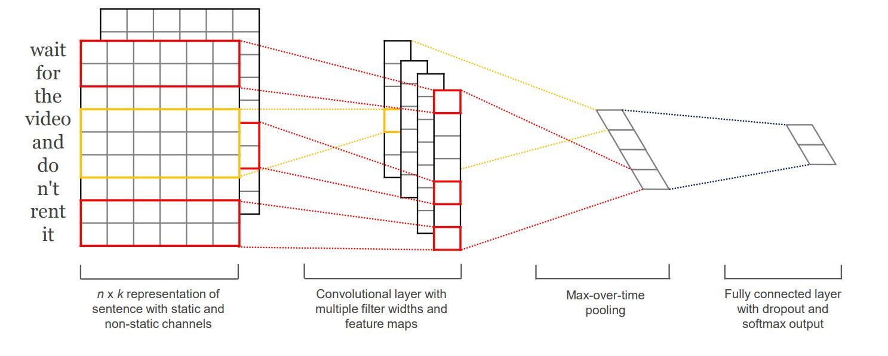
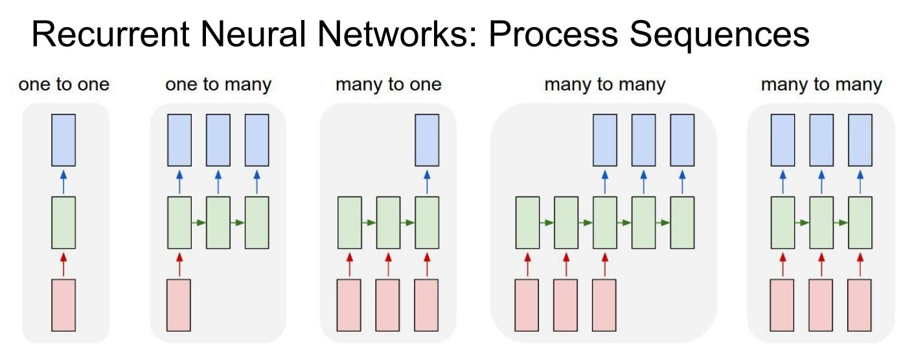
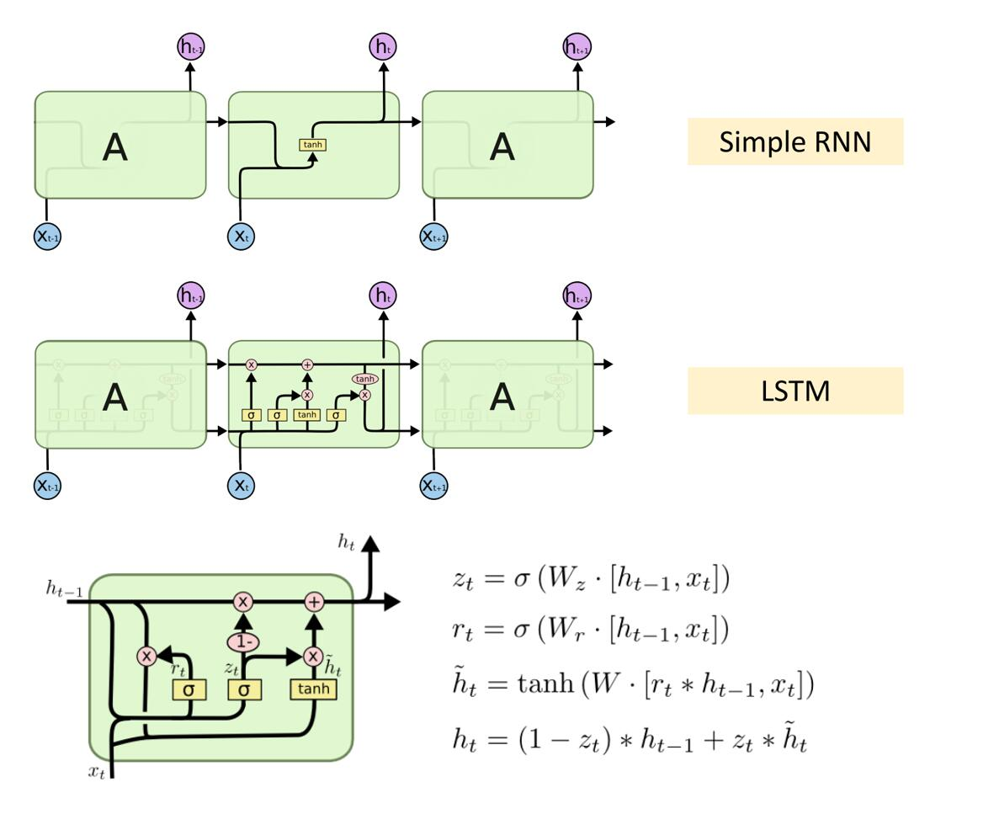

# [文本编码(Word2Vec)](https://arxiv.org/pdf/1301.3781.pdf)
第一步先进行编码: nn.Embedding(vocab_size, embedding_size)
一个样本输入为一个向量$X \in R^s$, 表示句话由s个字符组成, $X_i \in (0, v)$, v表示词典库大小(vocab_size), 经过嵌入编码后$X \in R^{s \times e}$, e表示为单词向量维数(embedding_size), 嵌入编码为先将每个单词的索引转为one-hot编码, 然后乘以编码举证, 过程为$(s \times v) \otimes (v \times e) \rightarrow (s \times e)$。

# 文本分类-CNN

## conv1d
<div align=center>

<center>图1 </center>
</div>

$$
\text{out}(N_i, C_{\text{out}_j}) = \text{bias}(C_{\text{out}_j}) +
    \sum_{k = 0}^{C_{in} - 1} \text{weight}(C_{\text{out}_j}, k)
    \star \text{input}(N_i, k)
$$


```python
class TextCnn1d(nn.Module):
    def __init__(self, vocab_size, embed_size, num_classes):
        super().__init__()
        outchannel = 100
        self.embed = nn.Embedding(vocab_size, embed_size)
        self.conv1d = nn.Conv1d(embed_size, outchannel, kernel_size=3)
        self.fc = nn.Linear(outchannel, num_classes)

    def forward(self, x):
        # x: (B, L)
        x = self.embed(x).permute(0, 2, 1)      # (B, L, E)-->(B, E, L)
        x = self.conv1d(x)
        x = F.adaptive_avg_pool1d(x, 1).flatten(start_dim=1)         # (B, L, 1)
        x = self.fc(x)
        return x
```

## [conv2d-Convolutional Neural Networks for Sentence Classification](https://aclanthology.org/D14-1181.pdf)

<div align=center>

<center>图2 </center>
</div>

```python
class TextCnn2d(nn.Module):
    def __init__(self, vocab_size, embed_size, num_classes):
        super(TextCnn2d, self).__init__()
        outchannel = 100
        self.embed = nn.Embedding(vocab_size, embed_size)
        self.conv2d = nn.Conv2d(1, outchannel, kernel_size=3)
        self.fc = nn.Linear(outchannel, num_classes)

    def forward(self, x):
        # x: (B, L)
        x = self.embed(x).unsqueeze(1) # (B, L, E)-->(B, channel=1, L(H), E(W))
        x = self.conv2d(x)
        x = F.adaptive_avg_pool2d(x, 1).flatten(start_dim=1)        # (B, C, 1)-->(B, C)
        x = self.fc(x)
        return x
```

# 文本分类-RNN/LSTM

## RNN
<div align=center>

<center>图2</center>
</div>

## RNN
<div align=center>

<center>图3 Recurrent Neural Networks (RNNs)</center>
</div>

```python
class RnnBaseImp(nn.Module):
    # in multi layers case, other than first layer which input is input_size
    def __init__(self, input_size, hidden_size, bias=False, mode='RNN_TANH', num_layers=1, bidirectional=False):
        super().__init__()
        self.num_layers = num_layers
        self.bidirectional = bidirectional
        self.mode = mode
        num_directions = 2 if bidirectional else 1
        if mode == 'LSTM':
            gate_size = 4 * hidden_size
        elif mode == 'GRU':
            gate_size = 3 * hidden_size
        elif mode == 'RNN_TANH':
            gate_size = hidden_size
        elif mode == 'RNN_RELU':
            gate_size = hidden_size
        self.layers = []
        for layer in range(num_layers):
            single_layers = []
            for direction in range(num_directions):
                layer_input_size = input_size if layer == 0 else hidden_size * num_directions
                w_ih = Parameter(torch.Tensor(gate_size, layer_input_size))
                w_hh = Parameter(torch.Tensor(gate_size, hidden_size))
                b_ih = Parameter(torch.Tensor(gate_size))
                # Second bias vector included for CuDNN compatibility. Only one bias vector is needed in standard definition.
                b_hh = Parameter(torch.Tensor(gate_size))
                if bias:
                    layer_params = (w_ih, w_hh, b_ih, b_hh)
                else:
                    layer_params = (w_ih, w_hh)
                single_layers.append(layer_params)
            self.layers.append(single_layers)
    
    def forward(self, x, h0=None):
        num_directions = 2 if self.bidirectional else 1
        if h0 is None:
            h0 = torch.zeros(self.num_layers * num_directions, x.size(0), self.hidden_size, dtype=x.dtype, device=x.device)
        hn = h0
        return x,hn
```

