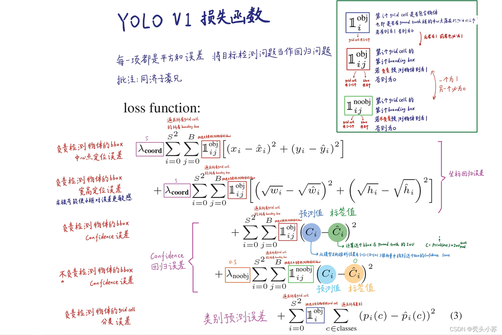
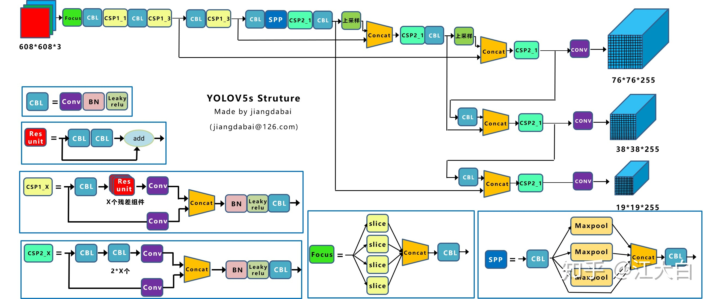

# Object Detection: A Survey
## MilleStone
<div align=center>

</div>

# IOU

```python
# IOU计算
def iou(box1, box2):
    # box1:(N, 4), box2:(M, 4)
    N = box1.size(0)
    M = box2.size(0)
    # left top
    lt = torch.max(
        box1[:, :2].unsqueeze(1).expand(N, M, 2),   # [N,2]->[N,1,2]->[N,M,2]
        box2[:, :2].unsqueeze(0).expand(N, M, 2),   # [M,2]->[1,M,2]->[N,M,2]
    )
    rb = torch.min(
        box1[:, 2:].unsqueeze(1).expand(N, M, 2),
        box2[:, 2:].unsqueeze(0).expand(N, M, 2),
    )

    wh = rb - lt  # [N,M,2]
    wh[wh < 0] = 0   # 两个box没有重叠区域
    inter = wh[:,:,0] * wh[:,:,1]   # [N,M]
    area1 = (box1[:,2]-box1[:,0]) * (box1[:,3]-box1[:,1])  # (N,)
    area2 = (box2[:,2]-box2[:,0]) * (box2[:,3]-box2[:,1])  # (M,)
    area1 = area1.unsqueeze(1).expand(N,M)  # (N,M)
    area2 = area2.unsqueeze(0).expand(N,M)  # (N,M)
    iou = inter / (area1+area2-inter)
    return iou
```

# NMS
NMS（非极大抑制）
NMS算法一般是为了去掉模型预测后的多余框, 其一般设有一个nms_threshold=0.5, 具体的实现思路如下：
1, 选取这类box中scores最大的哪一个, 记为box_best, 并保留它
2, 计算box_best与其余的box的IOU
3, 如果其IOU>0.5了, 那么就舍弃这个box（由于可能这两个box表示同一目标, 所以保留分数高的哪一个）
4, 从最后剩余的boxes中, 再找出最大scores的哪一个, 如此循环往复

```python
# NMS算法
def nms(bboxes, scores, threshold=0.5):
    # bboxes:(N, 4), scores:(N,)
    x1,y1, x2,y2 = bboxes[:]
    areas = (x2-x1)*(y2-y1)   # [N,] 每个bbox的面积
    _, order = scores.sort(0, descending=True)    # 降序排列
    keep = []
    while order.numel() > 0:       # torch.numel()返回张量元素个数
        if order.numel() == 1:     # 保留框只剩一个
            i = order.item()
            keep.append(i)
            break
        else:
            i = order[0].item()    # 保留scores最大的那个框box[i]
            keep.append(i)

        # 计算box[i]与其余各框的IOU(思路很好)
        xx1 = x1[order[1:]].clamp(min=x1[i])   # [N-1,]
        yy1 = y1[order[1:]].clamp(min=y1[i])
        xx2 = x2[order[1:]].clamp(max=x2[i])
        yy2 = y2[order[1:]].clamp(max=y2[i])
        inter = (xx2-xx1).clamp(min=0) * (yy2-yy1).clamp(min=0)   # [N-1,]

        iou = inter / (areas[i]+areas[order[1:]]-inter)  # [N-1,]
        idx = (iou <= threshold).nonzero().squeeze() # 注意此时idx为[N-1,] 而order为[N,]
        if idx.numel() == 0:
            break
        order = order[idx+1]  # 修补索引之间的差值
    return torch.LongTensor(keep)   # Pytorch的索引值为LongTensor
```

# Two-stage detector

## [RCNN](https://arxiv.org/pdf/1311.2524.pdf)

## Method

<div align=center>

<center>R-CNN Pipeline</center>
</div>


2. Extract region proposals

objectness--[Measuring the objectness of image windows](http://calvin-vision.net/wp-content/uploads/Publications/alexe12pami.pdf)

selective search--[Selective Search for Object Recognition](http://www.huppelen.nl/publications/selectiveSearchDraft.pdf)

category-independent object proposals--[Category Independent Object Proposals](http://dhoiem.cs.illinois.edu/publications/pami2013_proposals_endres.pdf)

## 附录

### B. Positive vs negative 样本和softmax
判断一个建议框是否含有对象和对应的类别, 这儿使用的是IOU超过多少即为有对象。
### C. Bounding-box 回归
training-pair $\{P^i, G^i\}_{i=1,...,N}$, 其中 $P^i = (P_x^i, P_y^i, P_w^i, P_h^i)$ 是建议框的中心坐标和宽高, 同理$G^i$也是一样
$$
\hat{G}_x = P_wd_x(P)+P_x\\
\hat{G}_y = P_hd_y(P)+P_y\\
\hat{G}_w = P_wexp(d_w(P))\\
\hat{G}_h = P_hexp(d_h(P))
$$
其中 $d_*(P)=w_*^T \phi_5(P)$, 其中P是建议框中在CNN中某一池化层输出的特征。损失函数: 
$$
w_* = \mathop{\arg\min}\limits_{w_*} \sum_i^N(t_*^i-\hat{w}_*^T \phi_5(P^i))^2 + \lambda \left\lVert \hat{w}_* \right\rVert^2
$$
其中$t_*^i$为对应的逆操作。

## [SPPNet](https://arxiv.org/pdf/1406.4729.pdf)
<div align=center>

<center>对输入的特征图分别划分为16个、4个、1个不重叠区域池化</center>
</div>

## [Fast R-CNN](https://arxiv.org/pdf/1504.08083.pdf)
<div align=center>

<center></center>
</div>
## 贡献点
1, 比R-CNN和SPPnet更高的检测质量, 训练时使用多任务损失, 变成单阶段训练。
2, 训练会更新CNN中所有参数, 不需要临时存储特征了。
3, 主要做法是先提出建议框, 然后对应到网络中提取ROI特征, 相当于只用提取一次特征。


## [Faster R-CNN](https://arxiv.org/pdf/1506.01497.pdf)

<div align=center>

<center></center>
</div>
<div align=center>

<center></center>
</div>

## 实现细节
1. 特征提取: 原文方法大概是通过一个CNN网络(可以是VGG、ResNet), 输入$M \times N \times 3$大小的图片经过CNN特征提取网络固定变为$(M/16) \times (N/16) \times C$大小的特征图其中$C为特征通道数量。
2. RPN, 比较复杂的是创建对应的标签。1)先对RPN提出的框做做NMS, 然后根据gt_bbox和label对应在RPN采样的框上，分背景和前景。
```python
#rpn中初始化定义的Layer
self.conv1 = nn.Conv2d(in_channels, mid_channels, 3, 1, 1)
self.score = nn.Conv2d(mid_channels, n_anchor * 2, 1, 1, 0) #n_anchor * 2 ，作为每个anchor的前景背景的分类得分，二分类所以*2
self.loc = nn.Conv2d(mid_channels, n_anchor * 4, 1, 1, 0) #n_anchor * 4，为每个anchor的中心坐标偏移比例和宽、高的各自的尺寸比
#rpn前传网络中连接
h = F.relu(self.conv1(x))  #x是extractor提取的feature maps
rpn_locs = self.loc(h) 
rpn_scores = self.score(h)		
```


# One-stage detector

## [YoloV1](https://arxiv.org/pdf/1506.02640.pdf)

<div align=center>

<center>Architecture</center>
</div>

<div align=center>

</div>

<div align=center>

<center>YoloV1 Loss, 空心1为指示函数(存在与否)</center>
</div>

1. yolo v1输入一张图片，经过backbone提取到$S \times S \times 1024$的特征图，其中$S$是预设置将图像划分为$S \times S$的grid参数，然后对单个通道做线性映射得到$S \times S \times (B \times 5 + C)$, 其中C代表类别数即每个类别的概率，B代表每个网格负责预测的bbox数量，推理时选择最大的一个作为该网格计算结果，5个值代表$(y, x, h, w, con)$, 其中$y,x$是相对于网格的偏移量，$h,w$是相对图片大小的归一化后的对数值。
2. GT生成方法: 先生成一个$(S, S, 6)$的全零数组，其中最后一个值代表类别，再根据GT_bbox映射在网格中的位置进行填充, 如果两个物体中心落在相同的网格则后面的会覆盖前面的，按照预先设计计算其中数值。

```python
# 生成训练GT
def generate_dxdywh(gt_label, w, h, s):
    xmin, ymin, xmax, ymax = gt_label[:-1]
    # compute the center, width and height
    c_x = (xmax + xmin) / 2 * w
    c_y = (ymax + ymin) / 2 * h
    box_w = (xmax - xmin) * w
    box_h = (ymax - ymin) * h
    if box_w < 1. or box_h < 1.:
        # print('A dirty data !!!')
        return False    
    # map center point of box to the grid cell
    c_x_s = c_x / s
    c_y_s = c_y / s
    grid_x = int(c_x_s)
    grid_y = int(c_y_s)
    # compute the (x, y, w, h) for the corresponding grid cell
    tx = c_x_s - grid_x
    ty = c_y_s - grid_y
    tw = np.log(box_w)
    th = np.log(box_h)
    weight = 2.0 - (box_w / w) * (box_h / h)
    return grid_x, grid_y, tx, ty, tw, th, weight

def gt_creator(input_size, stride, label_lists=[], name='VOC'):
    assert len(input_size) > 0 and len(label_lists) > 0
    # prepare the all empty gt datas
    batch_size = len(label_lists)
    w = input_size[1]
    h = input_size[0]
    # We  make gt labels by anchor-free method and anchor-based method.
    ws = w // stride
    hs = h // stride
    s = stride
    gt_tensor = np.zeros([batch_size, hs, ws, 1+1+4+1])

    # generate gt whose style is yolo-v1
    for batch_index in range(batch_size):
        for gt_label in label_lists[batch_index]:
            gt_class = int(gt_label[-1])
            result = generate_dxdywh(gt_label, w, h, s)
            if result:
                grid_x, grid_y, tx, ty, tw, th, weight = result
                if grid_x < gt_tensor.shape[2] and grid_y < gt_tensor.shape[1]:
                    gt_tensor[batch_index, grid_y, grid_x, 0] = 1.0 # exist or not
                    gt_tensor[batch_index, grid_y, grid_x, 1] = gt_class
                    gt_tensor[batch_index, grid_y, grid_x, 2:6] = np.array([tx, ty, tw, th])
                    gt_tensor[batch_index, grid_y, grid_x, 6] = weight
```

3. 缺点: 1)对于密集物体检测效果不佳，因为每个grid,cell只有一种类别以及只预测两个bbox, 2)对于未见过的物体尺寸或者配置，检测效果不佳, 主要误差存在于定位精度上

## [YoloV2](https://arxiv.org/pdf/1612.08242.pdf)

<div align=center>

<center>Architecture</center>
</div>

<div align=center>

<center>Architecture</center>
</div>

### 改进点
1. Batch Normalization: 在训练过程中加入BN层移除dropout层，同样可以达到不错的效果，即为conv+bn+leakyRelu结构。
2. 更高分辨率，从224x224提升到448x448，在ImageNet先用224预训练，然后采用448进行微调10轮，涨点4%。
3. 使用Anchor Boxes, 使用faster-rcnn类似的anchor机制，map没有提升但是召回率提升较大，对后续任务肯定有很大提升，Anchor Boxes的选择与faster-rcnn有所不同，前者使用固定的设计方式，v2中则采用聚类方法统计训练集得到一个更好的先验知识，

## [YoloV3](https://arxiv.org/pdf/1804.02767.pdf)
<div align=center>

<center>Architecture</center>
</div>

1. DBL:代码中的Darknetconv2d_BN_Leaky，是yolo_v3的基本组件。就是卷积+BN+Leaky relu。
2. resn：n代表数字，有res1，res2, … ,res8等等，表示这个res_block里含有多少个res_unit。
3. concat：张量拼接。将darknet中间层和后面的某一层的上采样进行拼接。拼接的操作和残差层add的操作是不一样的，拼接会扩充张量的维度，而add只是直接相加不会导致张量维度的改变

其中最后一个卷积层的卷积核个数是255，是针对COCO数据集的80类：3*(80+4+1)=255，3表示一个grid cell包含3个bounding box，4表示框的4个坐标信息，1表示objectness score。上采样采用双线性插值。
一个回归框是由四个参数决定， [公式] 。yolov3是在训练的数据集上聚类产生prior boxes的一系列宽高(是在图像416x416的坐标系里)，默认9种。YOLOV3思想理论是将输入图像分成SxS个格子（有三处进行检测，分别是在52x52, 26x26, 13x13的feature map上，即S会分别为52,26,13），若某个物体Ground truth的中心位置的坐标落入到某个格子，那么这个格子就负责检测中心落在该栅格中的物体。三次检测，每次对应的感受野不同，32倍降采样的感受野最大（13x13），适合检测大的目标，每个cell的三个anchor boxes为(116 ,90),(156 ,198)，(373 ,326)。16倍（26x26）适合一般大小的物体，anchor boxes为(30,61)， (62,45)，(59,119)。8倍的感受野最小（52x52），适合检测小目标，因此anchor boxes为(10,13)，(16,30)，(33,23)。所以当输入为416×416时，实际总共有(52×52+26×26+13×13)×3=10647个proposal boxes。

## [YoloV4](https://arxiv.org/pdf/2004.10934.pdf)
<div align=center>

<center>Architecture</center>
</div>
输入端采用mosaic数据增强，
Backbone上采用了CSPDarknet53、Mish激活函数、Dropblock等方式，
Neck中采用了SPP、FPN+PAN的结构，
输出端则采用CIOU_Loss、DIOU_nms操作。
因此Yolov4对Yolov3的各个部分都进行了很多的整合

## [YoloV5]()
<div align=center>

<center>Architecture</center>
</div>

（1）输入端：Mosaic数据增强、自适应锚框计算、自适应图片缩放
（2）Backbone：Focus结构，CSP结构
（3）Neck：FPN+PAN结构
（4）Prediction：GIOU_Loss