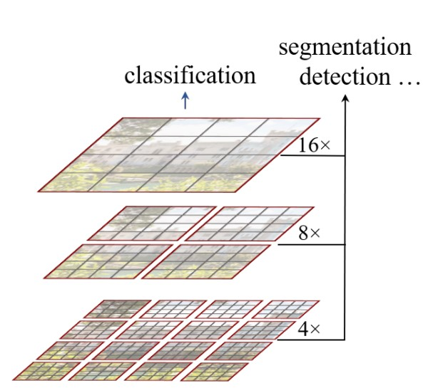
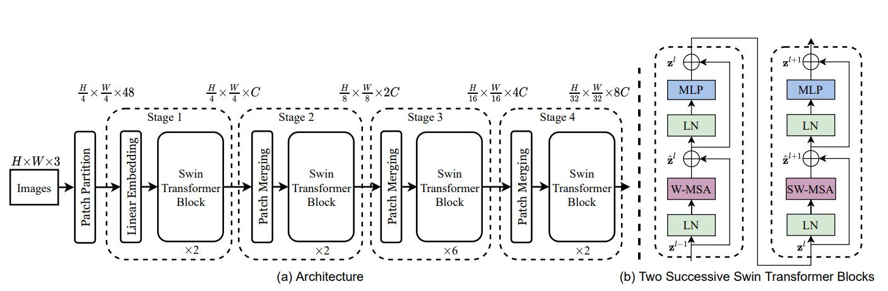
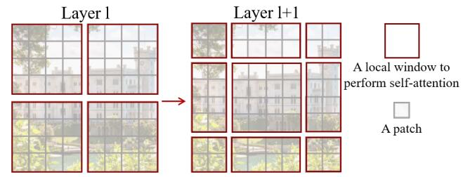
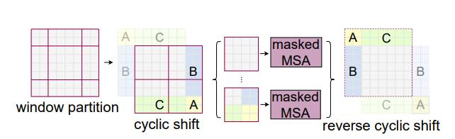

# Swin Traansformer

图1

## Method

### Architecture

图2

输入图像为(3, H, W), 将图像分为4x4的patch, 展平后的维度为4x4x3=48, 然后经过liner embedding, 得到设定维度C, Swin Transformer Block包含的token数量(patch的数量)为$\frac{h}{4} \times \frac{w}{4}$, 每个stage首先经过Patch Merge(stage1除外), 即重新合并2x2相邻的patch, 如图1所示, patch的数量减少为1/4, 进行concatenate起来得到新的patch的维度为4C, 经过一个linear层输出为2C的维度。

### Self-attention in non-overlapped (local) windows

图3

代码实现过程: 对tokens重组为2维格式, 在进行划分新的windows, 即(B, L, C)-->(B, H, W, C)-->($B \times \frac{H}{W_{size}} \times \frac{H}{W_{size}}, W_{size} \times W_{size}, C$)-->(B, H, W, C)-->(B, L, C)

图4

计算mask过程: 
