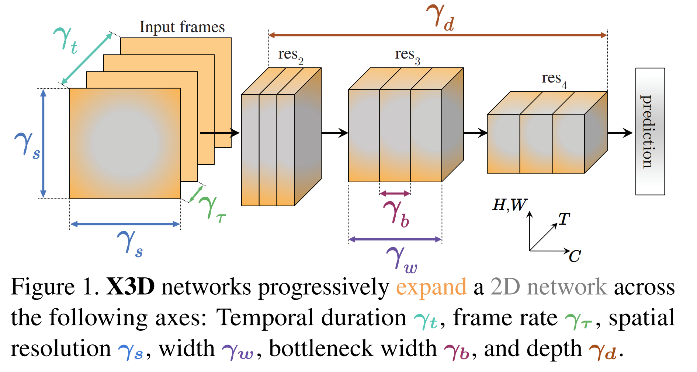
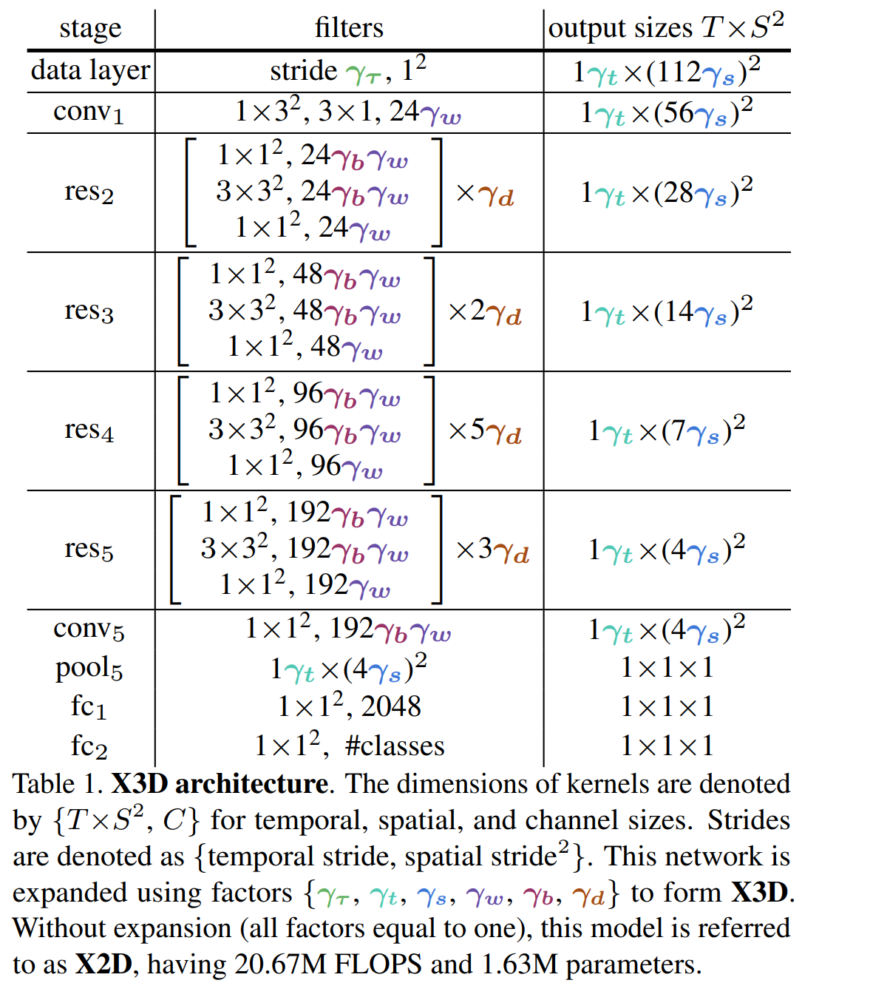

# [X3D: Expanding Architectures for Efficient Video Recognition](https://arxiv.org/pdf/2004.04730.pdf)

## 摘要和介绍
作者提出了一个高效的视频识别模型, 这个模型逐渐按照空间、时间、宽度和深度扩展一个小型的2D图像识别结构。这种灵感启发于机器学习中逐步网络在每一步只扩展一维的扩展方法, 如此达到了准确率和计算复杂度的折中。作者也发现即便在参数方面极其轻量的网络依然可以得到较好的表现, 这方面从实验数据也可以得到。
视频识别一般都是在时间维扩展2D图像上的识别方法, 在depth、width、空间上和时间上进行扩展, 这些方法都来源于2D图像，由于直接在时间维扩展，这样带来了非常巨大的计算复杂度。作者启发于移动端图像识别模型设计方法，从一个小的模型，探索从不同维度扩展网络，从不同的轴扩展模型可以带来准确率快速提升。
X3D从一个小的基本2D识别模型结构(来源MobileNet)扩展到时空模型，扩展的维度有temporal duration $\gamma_t$, frame rate $\gamma_\tau$ , spatial resolution $\gamma_s$, network width $\gamma_w$, bottleneck width $\gamma_b$, and depth $\gamma_d$.

