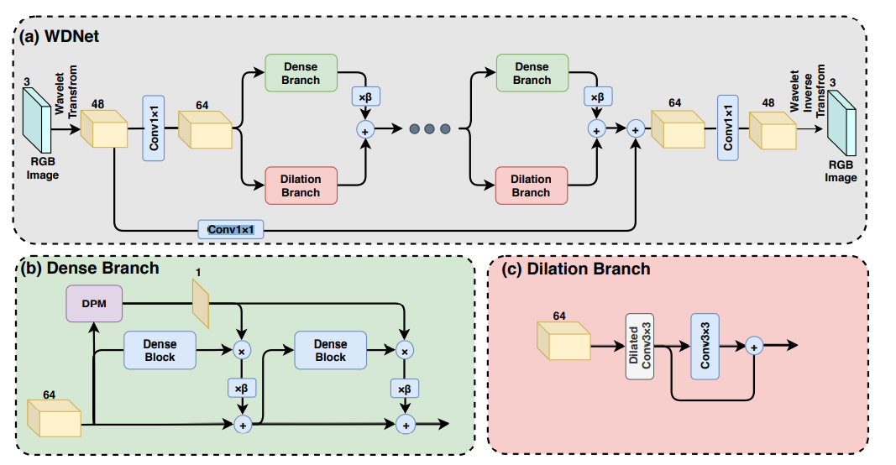
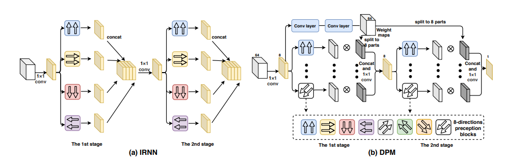

# [Wavelet-Based Dual-Branch Network for Image Demoireing](https://arxiv.org/pdf/2007.07173.pdf)

## Contributions
1 A novel wavelet-basd and dual-branch neural network for image demoireing, A spatial attention mechanism called direction perception module (DPM) to highlight the areas with moire pattern

## Method: WDNet

**Fig 1** (a) consisting of two kinds of branches, the dense branch (b) for restoring the close-range information and the dilation branch (c) for restoring the far-range information.

**Fig 2**  (a) Image recurrent neural network (IRNN). (b) Our direction perception module (DPM) with two stages, each with 8 directions

-(label*log(p)+(1-label)*log(1-p))
