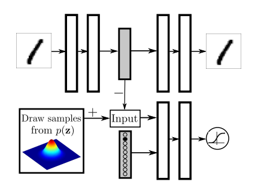

# GAN论文笔记


## [Auto-Encoding Variational Bayes(VAE-2014)](https://arxiv.org/pdf/1312.6114.pdf)

&emsp; 变分自动编码器


## GAN分类


## [Generative Adversarial Networks(GAN-2014)](https://arxiv.org/pdf/1406.2661.pdf)
### 算法原理  

&emsp;基于minimax对抗原理, GAN网络由生成器和判别器两部分组成。输入数据 $x \sim p_{data}$ , 对于生成器$G$, 给定分布$z \sim p_z$, 经过判别器后得到一个结构类似$x$的输出且$G(z) \sim p_g$, 而$p_g$则去逼近输入数分布$p_{data}$。对于判别器$D$, $D(x/G(z))$表示为真实(fake/valid)图片的概率。  
&emsp;训练生成器: $\ _{G}^{min} = log(1-D(G(z)))$  
&emsp;训练判别器: $\ _{D}^{max} = log(x)+log(1-D(G(z)))$   

&emsp;最终达到纳什均衡即完成训练(判别器正确率为50%, 判断对一半fake, 一半valid), 总体算法如下:


## [Conditional Generative Adversarial Nets(CGAN-2014)](https://arxiv.org/pdf/1411.1784.pdf)

### 算法原理  

<div align=center>

</div>

&emsp;除了网络的输入有区别, 其他地方与GAN一样

## [Deep Generative Image Models using a Laplacian Pyramid of Adversarial Networks(LAPGAN-2015)](https://arxiv.org/pdf/1506.05751.pdf)

### 图像金字塔
高斯金字塔(降采样): (1)对图像进行高斯核卷积, (2)将偶数行除去
拉普拉斯金字塔: (1)降采样然后上采样, (2)原图与重建图像差异: $L_i = G_i - Up(Down(Gi))$

### 算法原理 
1 用途：生成高品质的自然图片  
2 创新点：利用拉普拉斯金字塔, 由粗到精逐级生成越发清楚的图像。  
3 突破：GAN只能生成低像素的图片, 而LAPGAN可以生成高像素的图片。  
4 本质：用CGAN生成拉普拉斯金字塔。  
训练过程: 

使用推理过程: 


## [Unsupervised Representation Learning with Deep Convolutional Generative Adversarial Networks(DCGAN-2016)](https://arxiv.org/pdf/1511.06434.pdf)

没有很大的改进, 应用于Large-scale Scene Understanding (LSUN)
• Replace any pooling layers with strided convolutions (discriminator) and fractional-strided convolutions (generator).  
• Use batchnorm in both the generator and the discriminator.  
• Remove fully connected hidden layers for deeper architectures.  
• Use ReLU activation in generator for all layers except for the output, which uses Tanh.  
• Use LeakyReLU activation in the discriminator for all layers.  

## [Adversarial Autoencoders(AAE-2015)](https://arxiv.org/pdf/1511.05644.pdf)

<table>
<div align=center>

</div>
<tr>
    <td ><center></center></td>
    <td ><center></center></td>
</tr>
</table>

### 算法原理 
&emsp;encoder把输入数据分布p(x)映射到一个预定的先验分布q(z)—z为随机数，decoder从q(z)分布重建出原有图像，判别器对p(x)和q(z)进行判别
&emsp;训练步骤: 
&emsp;1. 自编码器的重构图像，使decoder能够从encoder生成的编码数据恢复出原始图像内容；
&emsp;2. 生成器和判别器的对抗学习，这里首先训练判别器D来区分输入的编码向量z来自q(z)还是p(z)，然后训练生成器（编码器）生成更加接近p(z)的q(z)来欺骗判别器D。

## [Energy-based Generative Adversarial Network(EBGAN-2017)](https://arxiv.org/pdf/1609.03126.pdf)

### 算法原理 


**repelling regularizer(排斥正则化)**  
S为自编码器中编码得到的向量
$$
f_{P T}(S)=\frac{1}{N(N-1)} \sum_{i} \sum_{j \neq i}\left(\frac{S_{i}^{\top} S_{j}}{\left\|S_{i}\right\|\left\|S_{j}\right\|}\right)^{2}
$$

**Objective functional:**  
$$
\ L_D(x,z) = D(x) + [m-D(G(z))]^+
\\
\ L_G(z) = D(G(z))+f_{P T}(S)
$$
其中 $[·] = max(0, \ ·)$,  EBGAN改动了discriminator(auto-encoder), 鉴别器不再鉴别输入来自于$p_{data}$还是$p_g$, 而是去鉴别图像的重构性高不高。原始discriminator的目的是学会寻找$p_data$与$p_g$之间的差异进而给图像质量打分，现在不再通过寻找差异来打分，而是使用一种“一种强烈的记忆”仅仅记住$p_data$的形状，然后对于一个任意的输入x，只要x符合这个记忆的样子就给高分，反之给低分。
&emsp;训练方法: 先可以预训练这个自编码器，然后生成器使用自编码器与排斥正则化进行优化训练

## [BEGAN: Boundary Equilibrium Generative Adversarial Networks(BEGAN-2017)](https://arxiv.org/pdf/1703.10717.pdf)
主要贡献为提出Boundary Equilibrium GAN, 结构为一个生成器和自编码器如EBGAN图: 
$$
\begin{cases}\mathcal{L}_{D}=\mathcal{L}(x)-k_{t} \cdot \mathcal{L}\left(G\left(z_{D}\right)\right) & \text { for } \theta_{D} \\ \mathcal{L}_{G}=\mathcal{L}\left(G\left(z_{G}\right)\right) & \text { for } \theta_{G} \\ k_{t+1}=k_{t}+\lambda_{k}\left(\gamma \mathcal{L}(x)-\mathcal{L}\left(G\left(z_{G}\right)\right)\right) & \text { for each training step } t\end{cases}
\newline
\mathcal{M}_{global} = \mathcal{L}(x) + |\gamma \mathcal{L}(x) - \mathcal{L}(G(z_G))|
$$

## [Progressive Growing of GANs for Improved Quality, Stability, and Variation(PROGAN-2018)](https://arxiv.org/pdf/1710.10196.pdf)

### 算法原理

<div align=center>

</div>
&emsp;本方法为从低分辨率图像逐渐生成高分辨图像。训练方法: 先设置好训练深度，每个深度输出分辨率是前一个深度的两倍，初始产生4x4的图像，逐渐向后加一个模块(提升分辨率为两倍)，一个深度训练到收敛才训练下一级网络。  

**平滑分辨率**
<div align=center>

</div>

## [Semi-Supervised Learning with Generative Adversarial Networks(SGAN-2016)](https://arxiv.org/pdf/1606.01583.pdf)

&emsp; 本文将产生式对抗网络（GAN）拓展到半监督学习，通过强制判别器来输出类别标签。我们在一个数据集上训练一个产生式模型 G 以及 一个判别器 D，输入是N类当中的一个。在训练的时候，D被用于预测输入是属于 N+1的哪一个，这个+1是对应了G的输出。
<div align=center>

</div>

## [Self-Attention Generative Adversarial Networks(SAGAN-2018)](https://arxiv.org/pdf/1805.08318.pdf)

<div align=center>

</div>

&emsp; 在进入f(x)前通过一个1x1conv, 然后把特征图平铺为一个序列，然后与通道维度进行交换
```python
def forward(self,x):
    # x(B, C, H, W)
    m_batchsize,C,width ,height = x.size()
    proj_query  = self.query_conv(x).view(m_batchsize,-1,width*height).permute(0,2,1) # B X CX(N)
    proj_key =  self.key_conv(x).view(m_batchsize,-1,width*height) # B X C x (*W*H)
    energy =  torch.bmm(proj_query,proj_key) # transpose check
    # 第一列：第一个位置向量在其他位置所产生的注意力，其他位置同理
    attention = self.softmax(energy) # BX (N) X (N) 
    proj_value = self.value_conv(x).view(m_batchsize,-1,width*height) # B X C X N
    # 与注意力相乘后得到全局热度值
    out = torch.bmm(proj_value,attention.permute(0,2,1) )   # B X C X N
    out = out.view(m_batchsize,C,width,height)
    out = self.gamma*out + x
    return out,attention
```

## [Large Scale GAN Training for High Fidelity Natural Image Synthesis(BigGAN-2019)](https://arxiv.org/pdf/1809.11096.pdf)

**网络结构**

<div align=center>

</div>

```python
# BigGANBatchNorm
def forward(self, x, truncation, condition_vector=None):
    # Retreive pre-computed statistics associated to this truncation
    coef, start_idx = math.modf(truncation / self.step_size)
    start_idx = int(start_idx)
    if coef != 0.0:  # Interpolate
        running_mean = self.running_means[start_idx] * coef + self.running_means[start_idx + 1] * (1 - coef)
        running_var = self.running_vars[start_idx] * coef + self.running_vars[start_idx + 1] * (1 - coef)
    else:
        running_mean = self.running_means[start_idx]
        running_var = self.running_vars[start_idx]

    if self.conditional:
        running_mean = running_mean.unsqueeze(0).unsqueeze(-1).unsqueeze(-1)
        running_var = running_var.unsqueeze(0).unsqueeze(-1).unsqueeze(-1)

        weight = 1 + self.scale(condition_vector).unsqueeze(-1).unsqueeze(-1)
        bias = self.offset(condition_vector).unsqueeze(-1).unsqueeze(-1)

        out = (x - running_mean) / torch.sqrt(running_var + self.eps) * weight + bias
    else:
        out = F.batch_norm(x, running_mean, running_var, self.weight, self.bias,
                            training=False, momentum=0.0, eps=self.eps)
    return out
```

## [Adversarial Feature Learning(BiGAN-2016)](https://arxiv.org/pdf/1605.09782.pdf)

<div align=center>

</div>

## [Bidirectional Conditional Generative Adversarial Networks(BiCGAN-2017)](https://arxiv.org/pdf/1711.07461.pdf)

<div align=center>

</div>

## [InfoGAN: Interpretable Representation Learning by Information Maximizing Generative Adversarial Nets(InfoGAN-2016)](https://arxiv.org/pdf/1606.03657.pdf)

<div align=center>

</div>

&emsp; mutual information can be expressed as the difference of two entropy terms:
$$
I(X;Y) = H(X) − H(X|Y) = H(Y) − H(Y|X)
\newline
\ _G^{min} \ _D^{max} V_I(D, G) = V(D,G) − λI(c; G(z, c)) 
\newline
\ _{G,Q}^{min} \ _D^{max} V_{InfoGAN}(D, G, Q) = V(D, G) − λL_I(G, Q) 
$$

## [Conditional Image Synthesis With Auxiliary Classifier GANs(ACGAN-2017)](https://arxiv.org/pdf/1610.09585.pdf)
<div align=center>

</div>

